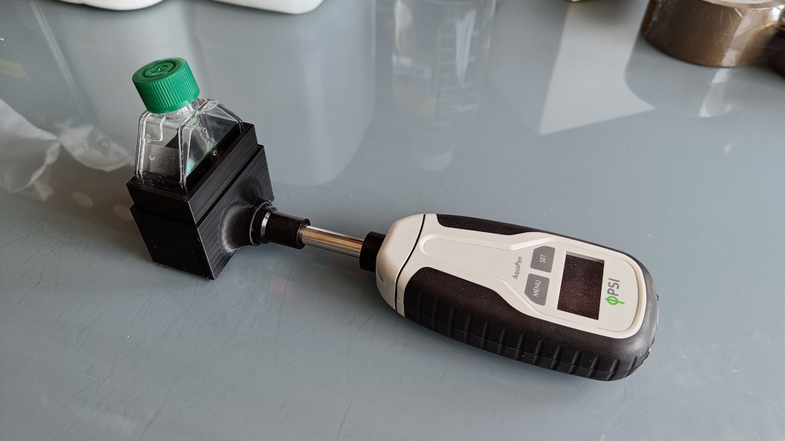
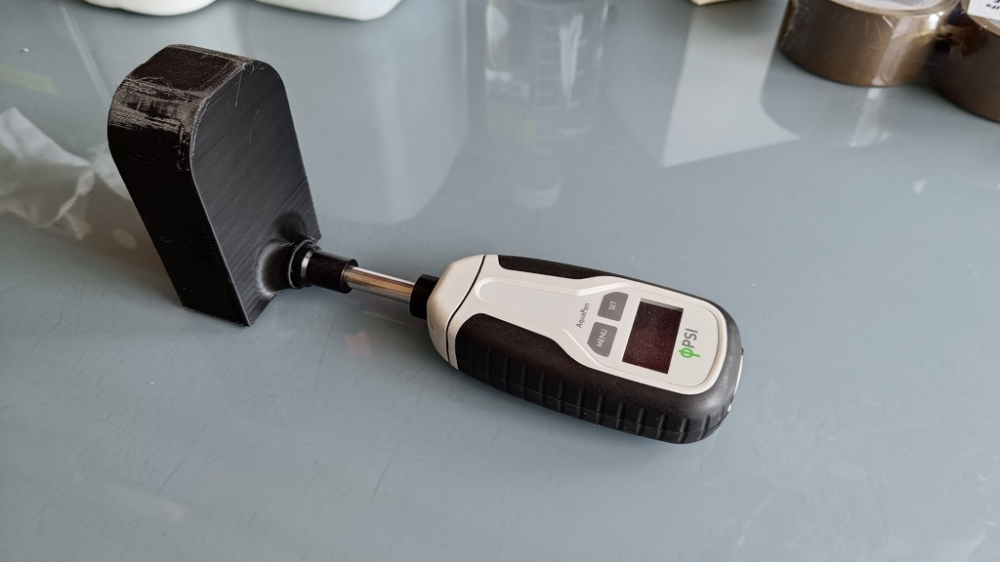

# Aquapen_flask_adapter
The device is designed to keep microalgal cultures in dark conditions to run chlorophyll fluorescence analyses with the Acquapen device from [Photon System Instruments](https://handheld.psi.cz/products/aquapen-c-and-aquapen-p/). The dark box allows to keep the T25 cell culture flask containing the microalgal culture in dark conditions while running the chlorophyll fluorescence analyses. For further details on these analyses please see [this article](https://doi.org/10.1093/jxb/ert208)

The box have been designed to run chlorophyll fluorescence analyses with a minimum culture volume in the T25 flask of 20 mL.

  

  

